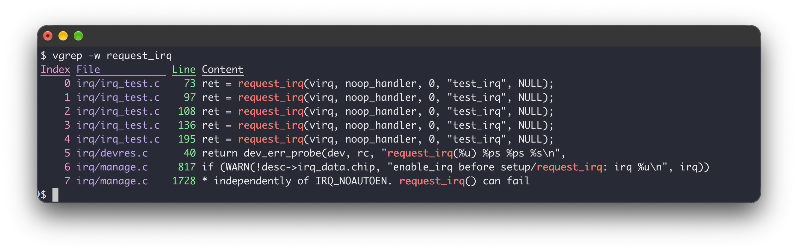
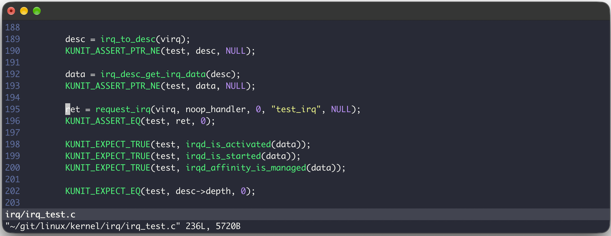
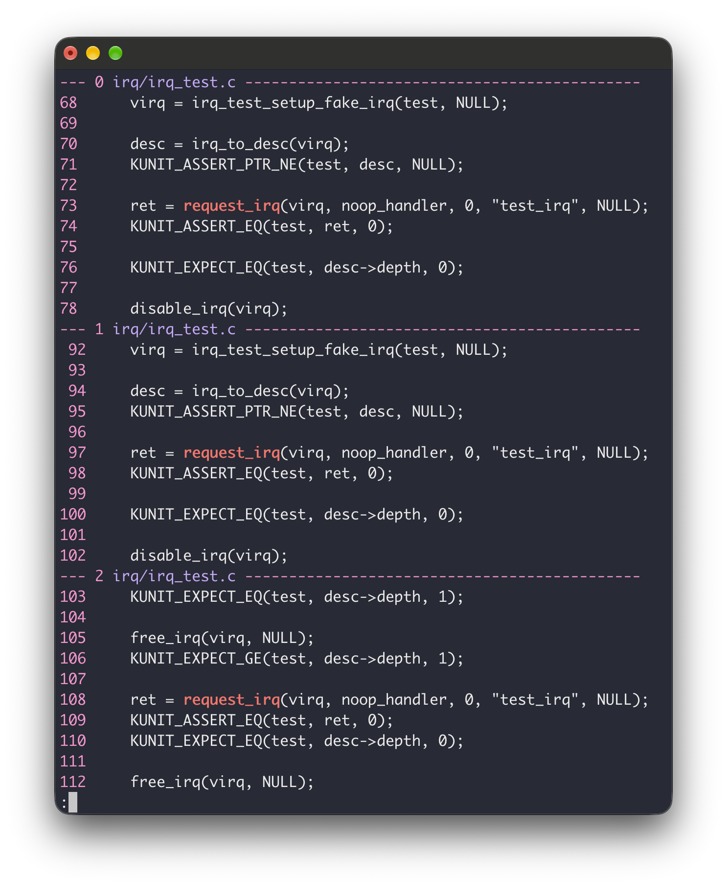
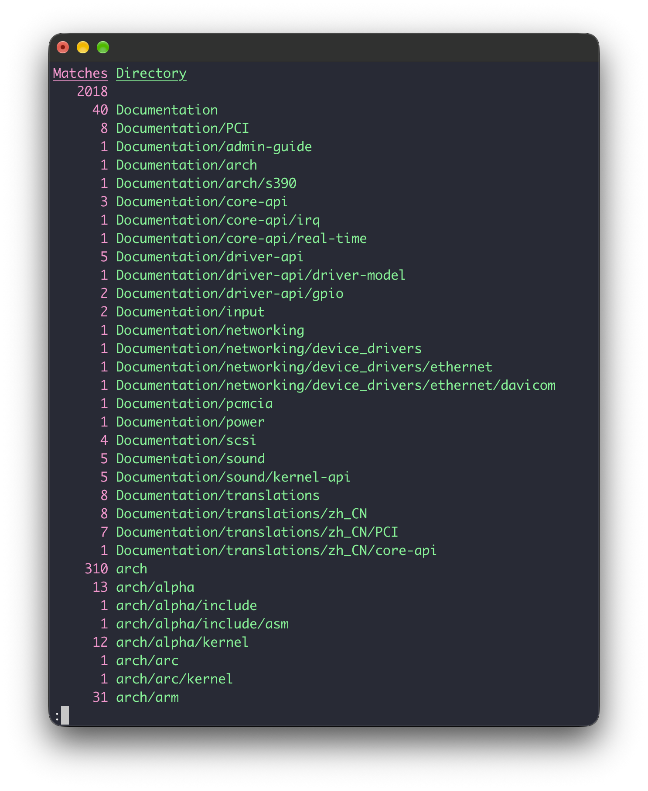
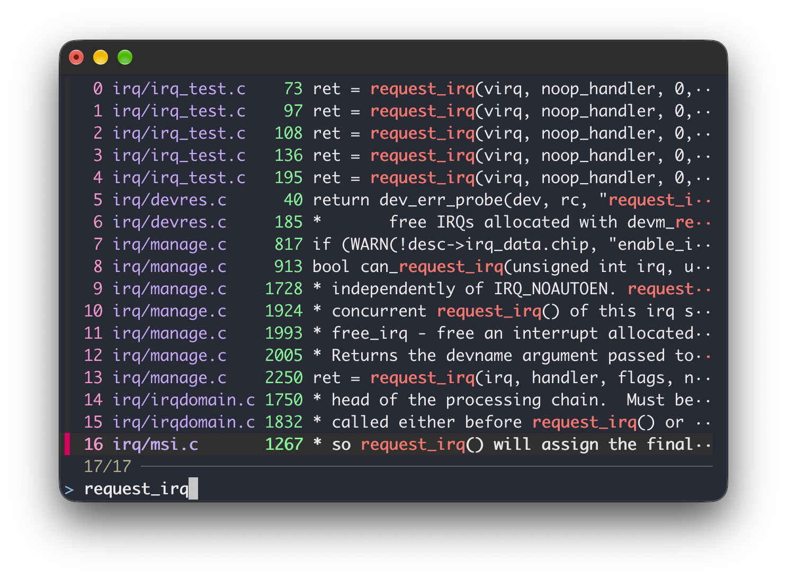

**vgrep** is a pager for `grep`, `git-grep`, `ripgrep` and similar grep implementations, and allows for opening the indexed file locations in a user-specified editor such as vim or emacs.  vgrep is inspired by the ancient **cgvg** scripts but extended to perform further operations such as listing statistics of files and directory trees or showing the context lines before and after the matches. vgrep runs on Linux, Windows and macOS.

Please, feel free to copy, improve, distribute and share.  Feedback and patches are always welcome!

# Installation Instructions

* You can install `vgrep` on [Fedora](https://src.fedoraproject.org/rpms/vgrep), [openSUSE](https://software.opensuse.org/package/vgrep), [archlinux](https://aur.archlinux.org/packages/vgrep/), [Gentoo](https://packages.gentoo.org/packages/app-text/vgrep), and on macOS via [MacPorts](https://ports.macports.org/port/vgrep/summary) and [Homebrew](https://formulae.brew.sh/formula/vgrep).
* On other systems, you can build and install `vgrep` manually via `make build` and `make install`.

# Options

| Flag | Description |
|------|-------------|
| `-s, --show SELECTORS` | Show specified matches or open the interactive shell |
| `-l, --files-with-matches` | Print matching files only |
| `--interactive` | Enter the interactive shell |
| `--no-header` | Do not print column headers |
| `--no-less` | Write to stdout instead of `less` |
| `--no-git` | Use grep instead of git-grep |
| `--no-ripgrep` | Do not use ripgrep |

All other flags and arguments are passed down to the underlying grep tool.  `vgrep` uses the first available search tool in this order: `ripgrep`, `git-grep` (when inside a git tree), `grep`.

`vgrep` respects the `NO_COLOR` environment variable to suppress all ANSI color output (see https://no-color.org/).

# Searching Patterns
The basic functionality of vgrep is to perform textual searches. On a technical level, vgrep serves as a front-end to grep or git-grep when invoking vgrep inside a git tree and uses `less` for displaying the results.  Results of the last search are cached, so running vgrep without a new query will load previous results and operate on them.

An example call may look as follows:



By default, the output will be written to `less` to make browsing large amounts of data more comfortable. `vgrep --no-less` will write to stdout.  The path to the cache is `$LOCALAPPDATA/vgrep-cache/vgrep-go` on Windows and `$HOME/.cache/vgrep-go` on Unix systems.

# Opening Matches
vgrep can open the indexed file locations in an editor specified by the `EDITOR` environment variable. Opening one of the file locations from the previous example may look as follows:

```
$ export EDITOR=vim
$ vgrep --show 4
```



The default editor of vgrep is `vim` with the default flag to open a file at a specific line being `+` followed by the line number.  If your editor of choice hits the rare case of a different syntax, use the `EDITORLINEFLAG` environment variable to adjust.  For example, a `kate` user may set the environment to ``EDITOR="kate"`` and ``EDITORLINEFLAG="-l"``.

Note that `vgrep` does not allow for searching and opening files at the same time. For instance, `vgrep --show=files text` should be split into two commands: `vgrep text` and `vgrep --show=files`.

## IDE Support

Note that if you run `vgrep` inside a terminal of VSCode or Goland, the format of listed files changes to "$PATH:$LINE" to allow for opening the matches in the editor via a simple mouse click.

# More Commands and the Interactive Shell

Once searched, you can perform certain operations on the results such as limiting the range of indexed matches, listing matching files and directories and more.
```
Enter a vgrep command: ?
vgrep command help: command[context lines] [selectors]
         selectors: '3' (single), '1,2,6' (multi), '1-8' (range), 'all'
          commands: print, show, context, tree, delete, keep, refine, files, grep, quit, ?
```
vgrep commands can be passed directly to the ``--show/-s`` flag, for instance as ``--show c5 1-10`` to show the five context lines of the first ten matched lines.  Furthermore, the commands can be executed in an interactive shell via the ``--interactive/-i`` flag. Running ``vgrep --interactive`` will enter the shell directly, ``vgrep --show 1 --interactive`` will first open the first matched line in the editor and enter the interactive shell afterward.

vgrep supports the following commands:

- ``print`` to limit the range of matched lines to be printed. ``p 1-12,20`` prints the first 12 lines and the 20th line.
- ``show`` to open the selectors in a user-specified editor (requires selectors).
- ``context`` to print the context lines before and after the matched lines. ``c10 3-9`` prints 10 context lines of the matching lines 3 to 9.  Unless specified, vgrep will print 5 context lines.
- ``tree`` to print the number of matches for each directory in the tree.
- ``delete`` to remove lines at selected indices from the results, for the duration of the interactive shell (requires selectors).
- ``keep`` to keep only lines at selected indices from the results, for the duration of the interactive shell (requires selectors).
- ``refine`` to keep only lines matching the provided regexp pattern from the results, for the duration of the interactive shell (requires a regexp string).
- ``files`` to print the number of matches for each file in the tree.
- ``grep`` to start a new search without leaving the interactive shell (requires arguments for a ``vgrep`` search). For example, ``g -i "foo bar" dir/`` will trigger a case-insensitive search for ``foo bar`` in the files under ``dir``. The cache will be updated with the results from the new search.
- ``quit`` to exit the interactive shell.
- ``?`` to show the help for vgrep commands.

## Examples

### Context lines


### Tree


# fzf Integration



If you desire a more interactive experience than running vgrep twice to first search and then to open an editor, you may have a look at fzf. The below function uses [fzf](https://github.com/junegunn/fzf) to interactively search with vgrep and open your editor at the correct line with a single key press.
To use it add the following function to your ``.bashrc`` and install fzf alongside vgrep and ripgrep.

```shell
vgrep() {
  INITIAL_QUERY="$1"
  VGREP_PREFIX="vgrep --no-header "
  FZF_DEFAULT_COMMAND="$VGREP_PREFIX '$INITIAL_QUERY'" \
  fzf --bind "change:reload:$VGREP_PREFIX {q} || true" --ansi --phony --tac --query "$INITIAL_QUERY" \
  | awk '{print $1}' | xargs -I{} -o vgrep --show {}
}
```

## For fish shell

The below version pipes the result of the initial query with `vgrep` to `fzf` to allow further selection among the results.

```fish
function vgf --wraps=vgrep --description 'vgrep search with fzf'
    set -f INITIAL_QUERY $argv[1]
    vgrep --no-header $INITIAL_QUERY | fzf --ansi --bind "Ctrl-d:half-page-down,Ctrl-u:half-page-up" | awk '{print $1}' | xargs -I{} -o vgrep --show {}
end
```

To have a variant, which restarts the search with `vgrep` on entering a new query, use the below version.

```fish
function vgF --wraps=vgrep --description 'vgrep search with fzf'
    set -f INITIAL_QUERY $argv[1]
    FZF_DEFAULT_COMMAND="vgrep --no-header $INITIAL_QUERY" fzf --bind "Ctrl-d:half-page-down,Ctrl-u:half-page-up,change:reload:vgrep --no-header {q} || true" --ansi --phony --tac --query $INITIAL_QUERY | awk '{print $1}' | xargs -I{} -o vgrep --show {}
end
```

For further details on use of `functions` with `fish` shell, see [here](https://fishshell.com/docs/current/language.html#syntax-function).
